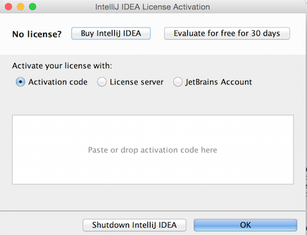
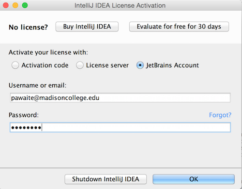
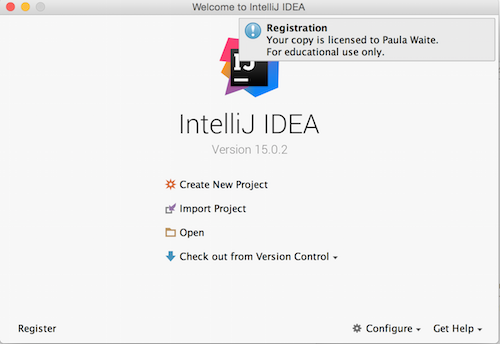
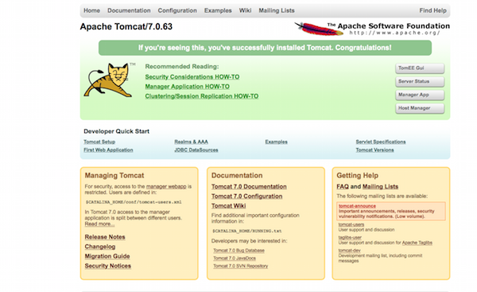

# Setup Verification For Ubuntu

### Git

1. Open Terminal and check the git version using the command "git --version".

    ```
    Paulas-MacBook-Pro:bin paulawaite$ git --version
    ```

    You should see something like this:

    ```
    git version 2.7.4
    ```  
&nbsp;
&nbsp;
    
### IntelliJ IDEA

1. Open IntelliJ IDEA.
1. The dialog below should open. If it doesn't, click "Configure" on the Welcome Screen, and then "Manage License".

    
    <br/><br/>

1. Choose to activate a new license with your JetBrains Account and complete the form with your username/email and password.

    
    <br/><br/>

1. You should see a welcome screen like this:

    

&nbsp;
&nbsp;

### TomEE+

1. Navigate to the bin directory of your tomEE+ install directory (tomcat).  
1. Run startup.sh to start the server. You should see something like this:  

    ```
    Paulas-MacBook-Pro:bin paulawaite$ ./startup.sh
    Using CATALINA_BASE:   /Users/paulawaite/Documents/tomee
    Using CATALINA_HOME:   /Users/paulawaite/Documents/tomee
    Using CATALINA_TMPDIR: /Users/paulawaite/Documents/tomee/temp
    Using JRE_HOME:        /Library/Java/Home
    Using CLASSPATH:       /Users/paulawaite/Documents/tomee/bin/bootstrap.jar:/Users/paulawaite/Documents/tomee/bin/tomcat-juli.jar
    Tomcat started.
    Paulas-MacBook-Pro:bin paulawaite$ 
    ```
1. Open a browser and navigate to http://localhost:8080. You should see something like this: 

    

1. If startup.sh fails, refer to the RUNNING.txt file in the root tomee install directory for help troubleshooting.
&nbsp;
&nbsp;

### MySQL

1. Run MySQL and log in (password is student).  
    	
    	student@ubuntu:~$ mysql -u root -p
    	Enter password: 

1. You should see something like this:
   
    	Welcome to the MySQL monitor.  Commands end with ; or \g.
    	Your MySQL connection id is 2658
    	Server version: 5.7.10 MySQL Community Server (GPL)
    
    	Copyright (c) 2000, 2015, Oracle and/or its affiliates. All rights reserved.

    	Oracle is a registered trademark of Oracle Corporation and/or its
    	affiliates. Other names may be trademarks of their respective
    	owners.

    	Type 'help;' or '\h' for help. Type '\c' to clear the current input statement.
   
1. Show databases to confirm things are working to this point. You should see something like:  

    ```
    mysql> show databases;
    +--------------------+
    | Database           |
    +--------------------+
    | information_schema |
    | mysql              |
    | performance_schema |
    | sys                |
    +--------------------+
    4 rows in set (0.00 sec)
    ```