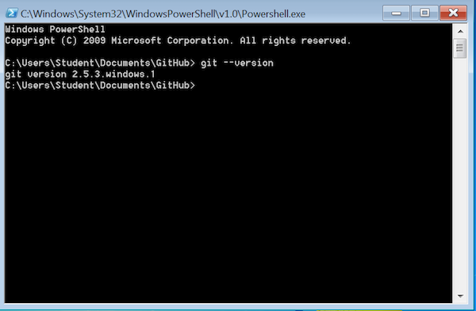
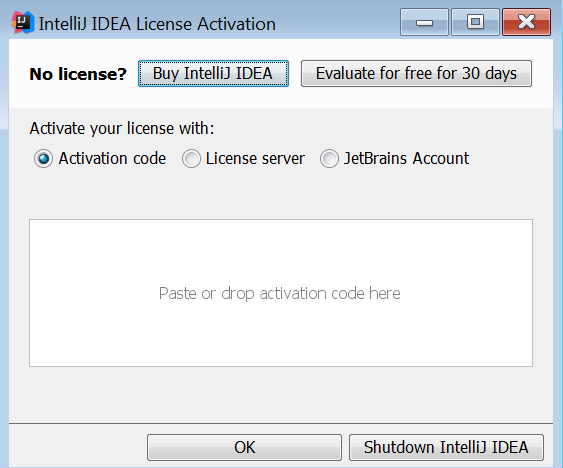
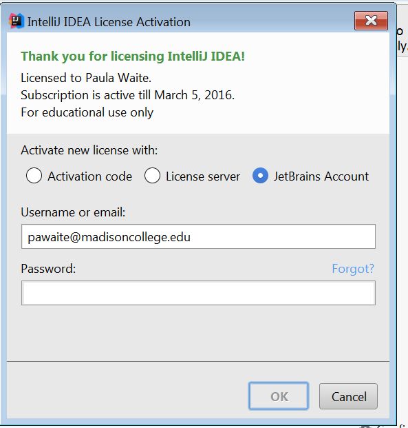
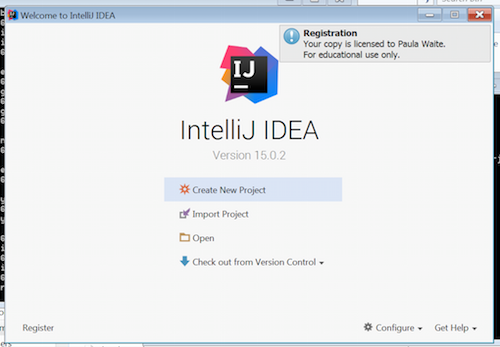
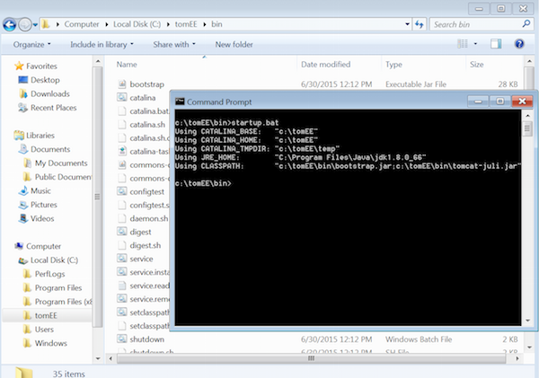
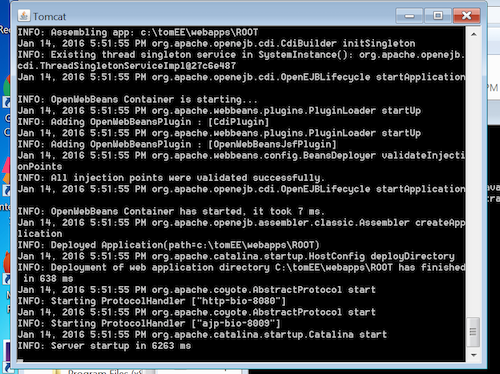
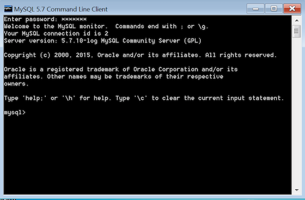
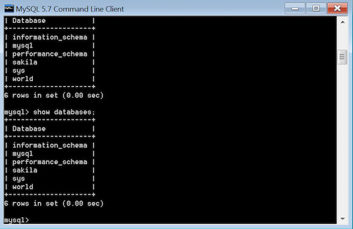

# Setup Verification For Windows

### Git

1. Open Git Shell (installed as part of GitHub Desktop) and check the git version using the command: 

		git --version

    You should see something like this (your version number may be slightly different):

    
 
### IntelliJ IDEA

1. Open IntelliJ IDEA.
1. The dialog below should open. If it doesn't, click "Configure" on the Welcome Screen, and then "Manage License".

    
      

1. Choose to activate a new license with your JetBrains Account and complete the form with your username/email and password.

    
      

1. You should see a welcome screen like this:

    

### TomEE+

1. Navigate to the bin directory of your tomEE+ install directory.  
1. Run startup.bat to start the server. 

    

    You should see something like this:  

    

1. Open a browser and navigate to http://localhost:8080. You should see this: 

    

1. If startup.bat fails, refer to the RUNNING.txt file in the root tomee install directory for help troubleshooting.

### MySQL

1. Open MySQL Command Line Client. 
1. Enter the password you set up during installation. 
    
    

1. Show databases to confirm things are working to this point. You should see something like:  

    

